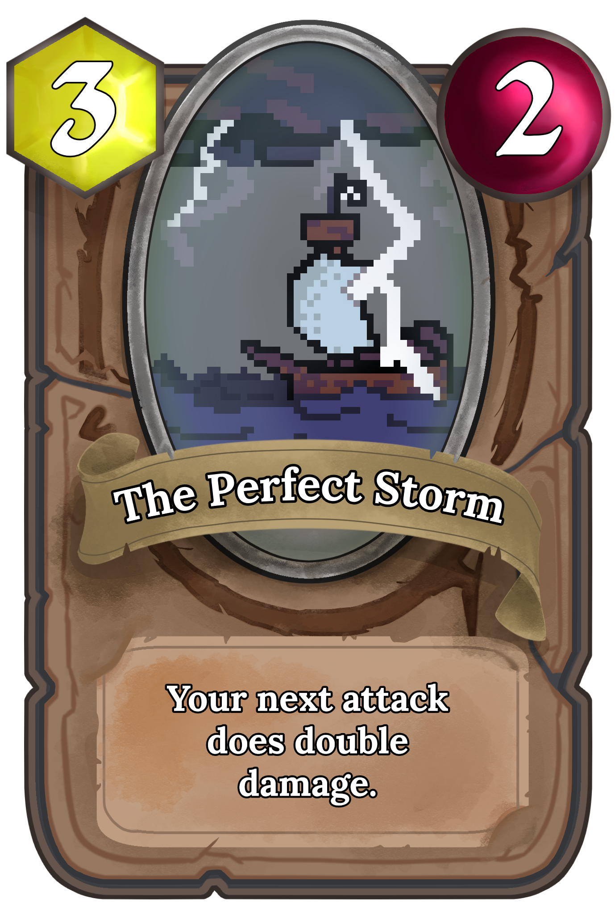
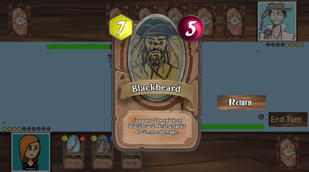

 # Card-RPG 

_Card RPG_ is a turn based card battler. Explore the world of Card RPG and defeat your opponents on the high seas, building your deck as you go.

## Features
- Two overworld maps to explore

- Several unique opponents to discover, each with their own special decks
- Dozens of unique cards

- AI card-battling opponents based on the Minimax algorithim with Alpha-Beta pruning

- LAN multiplayer to battle with your friends
- Soundtrack
- Progression mechanics, get better the more you fight

## Run Instructions
To run 'cargo run' in /card-rpg/

## Localhost Server Demo
1. In one terminal window, cd into 'card-server' and type 'cargo run'
2. In two additional terminal windows, type 'cargo run' in /card-rpg to get two clients running
3. In each client, navigate to the online screen via the main menu.
4. Check the outputs of each terminal once both clients are connected. Clicking the mouse anywhere on screen will send data between the two clients.
5. Clicking the 'return' button will take return to the main menu, where you can reconnect via the online button.
